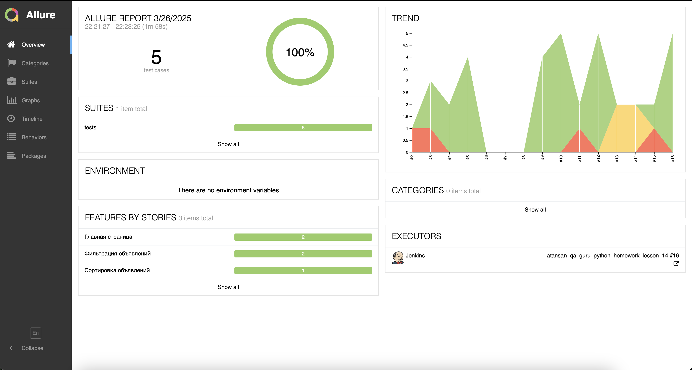
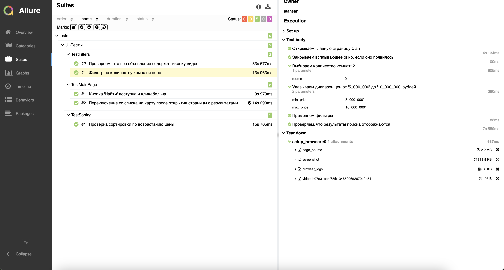
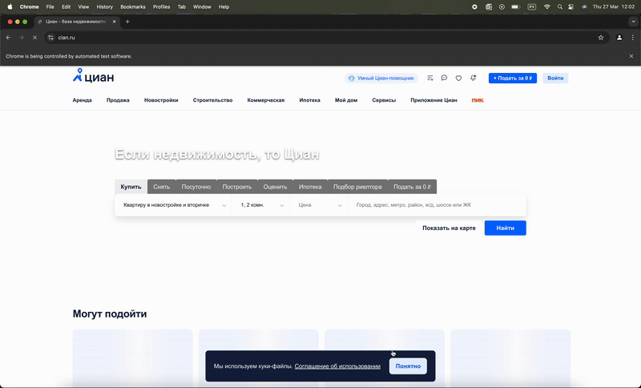
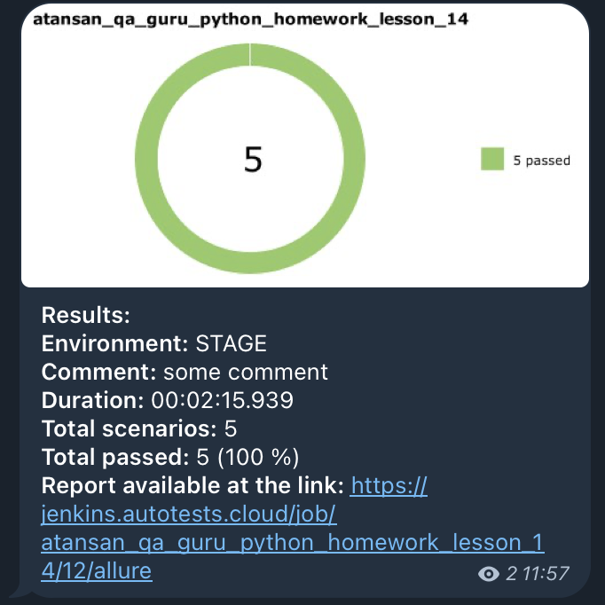

# Проект автоматизации сайта [Cian.ru](https://cian.ru)
___

### Используемый стек:  
          

---

## Что тестируется:

### 🔍 Поиск и фильтрация
- Поиск квартиры с параметрами: количество комнат, диапазон цен.
- Применение фильтра "С видео".
- Проверка отображения результатов после применения фильтров.

### 📊 Сортировка
- Проверка сортировки объявлений по возрастанию цены.

### 🗺 Вид отображения
- Переключение отображения с таблицы на карту.

### 🏠 Главная страница
- Проверка кликабельности кнопки "Найти".


---

## Структура проекта:

```
.
├── .env                        # Переменные окружения
├── conftest.py                 # Общие фикстуры и настройки запуска
├── pytest.ini                  # Настройки Pytest
├── requirements.txt            # Зависимости проекта

├── tests/                      # UI-тесты
│   ├── test_main_page.py       # Тесты главной страницы
│   ├── test_filters.py         # Тесты фильтрации и поиска
│   ├── test_sorting.py         # Тесты сортировки

├── pages/                      # Page Object'ы
│   ├── main_page.py            # Главная страница
│   ├── filters_page.py         # Фильтры
│   ├── search_results_page.py  # Результаты поиска

├── utils/                      # Вспомогательные утилиты
│   ├── __init__.py
│   ├── attach.py               # Вложения в Allure (видео, скриншоты)

├── images/                     # Скриншоты и .gif для README
```


---

## Как запустить тесты:

### ⚙️ Локально:
```bash
pytest tests/ --browser_version=134.0
```

### ☁️ Через Selenoid (удаленно):
```bash
pytest tests/ --remote --browser_version=134.0
```

---

## Jenkins CI:
1. Открыть [Jenkins Job](https://jenkins.autotests.cloud/job/atansan_qa_guru_python_homework_lesson_14/)
2. Нажать `Build with parameters`
3. Выбрать нужную версию браузера и параметры запуска (пример: ***127***)
4. Нажать `Build`
5. После завершения — открыть `Allure Report`

---

## Примеры отчётов:

### 📋 Allure Report — Общий результат


### 🔍 Allure Report — Подробный результат


### 🎬 Видеозапись выполнения теста (если опция включена)


### 📬 Уведомление через Telegram бота

---

## Автор проекта:
👩‍💻 **@TommyMadness** | Telegram: `@TommyMadness`  
📍 Автоматизация UI тестов с использованием Page Object, Pytest, Selene и Allure